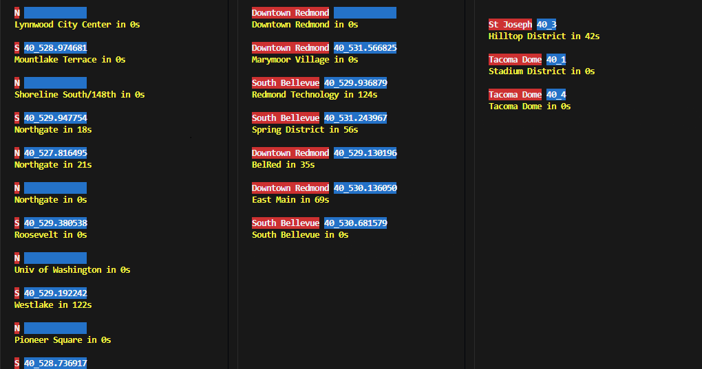

# seattle-link-light-rail

A set of small Python scripts that print the real-time position of Link Light Rail trains on a given line.

Based on and inspired by the work of @waldenhillegass (https://github.com/waldenhillegass/link-map).

The display order of trains is experimental and may be incorrect at times.



## Included files
- `seattle_Tline.py` — script for the T Line (Tacoma).
- `seattle_1line.py` — script for the 1 Line.
- `seattle_2line.py` — script for the 2 Line.
- `get_stops_for_route.py` — helper to list stop names for a route (interactive / CLI).
- `st_link.py` - script for all Lines.

## Quickstart
1. Install dependency:
```bash
pip install requests
```

2. Run a script:
```bash
python link-light-rail\seattle_1line.py
python link-light-rail\seattle_2line.py
python link-light-rail\seattle_Tline.py
python link-light-rail\st_link.py
python link-light-rail\get_stops_for_route.py
```

## Notes
- Each script uses the OneBusAway API and currently contains a dummy API key inside the script. Replace the key in the files if you have your own.
- Output is printed to the terminal with simple ANSI color formatting and includes vehicle id, direction, next stop and seconds until arrival.
- The code includes defensive handling for missing fields in API responses, but real-world responses can vary. Improvements are welcome.

## Acknowledgements
- Based on the link-map work by @waldenhillegass (https://github.com/waldenhillegass/link-map). Thanks for the inspiration.
- Data from Sound Transit Open Transit Data (OTD): https://www.soundtransit.org/help-contacts/business-information/open-transit-data-otd